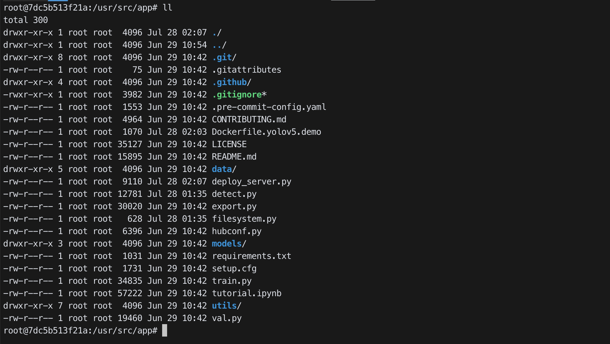
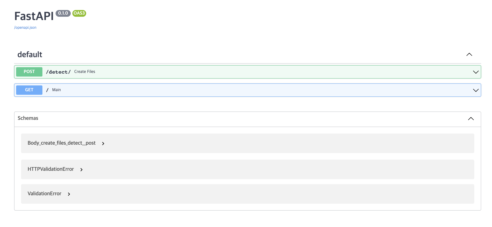
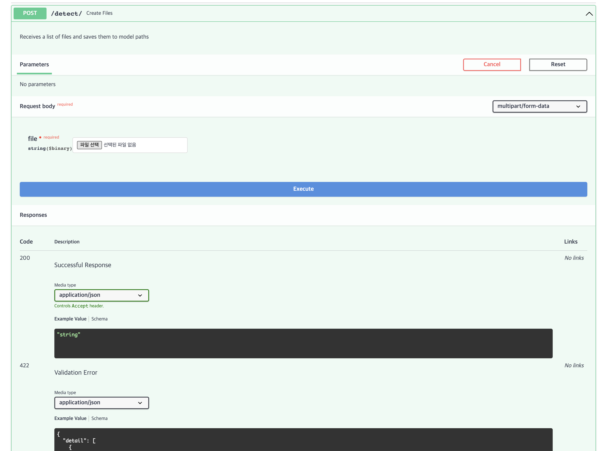

# YOLOv5 Demo
This directory is about YOLOv5 demo image. YOLOv5-Demo image is designed to be run as inference server.

## How to Run
1. **Using Backend.AI Session**
   
   Run `cr.backend.ai/testing/yolov5-demo` image and run below command.
   ```shell
   python3 deploy_server.py
   ```
2. **Not using Backend.AI Session** 
   
    If you dowonload this image from `cr.backend.ai/testing/yolov5-demo` registry, run below command
    ```shell
    docker run -it -p [host-port]:[container-port] cr.backend.ai/testing/yolov5-demo /bin/bash
    ```

    If you entered container, You can see the directory like below image.

    <p align='center'></p>

    Run command
    ```shell
    python3 deploy_server.py
    ```

    Then FastAPI server will be turned on and ready to serve the inference request.


## How to Request to Server
1. **OpenAPI**  
   1. Open your Chrome browser, and enter the `localhost:[host-port]/docs` then you can see the below image.
   
    <p align='center'></p>

   2. Click `/detect/` and upload image or video file.
   
    <p align='center'></p>
   
   3. Click `Execute` button. Then results will be shown.   
      1. Case of Image - output will be shown as image.
      2. Case of Video - output will be shown as Download link.

2. **Jupyter Notebook**     
   1. If Jupyter Notebook doesn't installed, install Jupyter Notebook with `pip install jupyter` first. 
   2. Open `yolov5-inference-notebook.ipynb`
   3. Follow step of `yolov5-inference-notebook.ipynb`

    <p align='center'></p>

    
    When you send curl request, please refer below command.
    ```shell
    curl -X 'POST' \
        'http://localhost:8886/detect/' \ # http://[host-ip]:[host-port]/detect/
        -H 'accept: application/json' \
        -H 'Content-Type: multipart/form-data' \
        -F 'file=@/Users/kangmin/seoul.jpg;type=image/jpeg' \ # file=@[input_file_path];type=image/jpeg
        -o 'inference.png' # name of output file

    curl -X 'POST' \
        'http://localhost:8886/detect/' \ # http://[host-ip]:[host-port]/detect/
        -H 'accept: application/json' \
        -H 'Content-Type: multipart/form-data' \
        -F 'file=@/Users/kangmin/Inside Ultralytics.mp4;type=video/mp4' \  # file=@[input_file_path];type=video/mp4
        -o 'inference.mp4' # name of output file
    ```